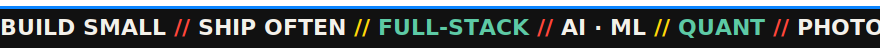
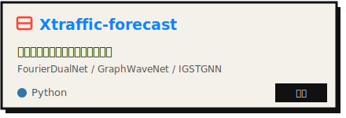
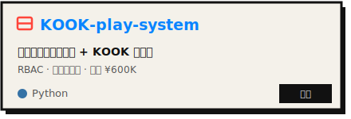
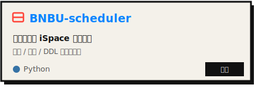
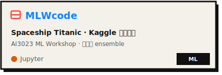
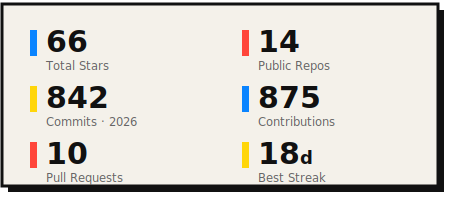
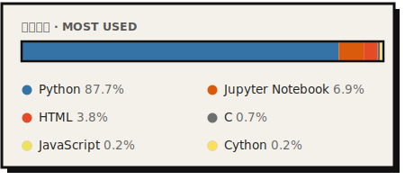

  

  

  

  
  &nbsp;
  

---

  

我喜欢把想法飞快写成能跑的东西，享受从 0 到上线那一下。白天全栈，晚上图神经网络和量化，深夜 debug。

> I turn ideas into things that actually run, from zero to shipped.
> Full-stack by day, graph nets and quant by night, debugging past midnight.

**`while (alive) { build(small); ship(often); }`**

---

- 🔭 **Currently working on** · 交通流预测的图神经网络，FourierDualNet vs STGNN
- 🌱 **Currently learning** · 更深的 GNN 架构、LLM agents、期权定价
- 💬 **Ask me about** · Flask / Vue 全栈、高并发快闪电商、量化回测
- ⚡ **Fun fact** · 给 BLACKPINK 快闪店写的系统扛过几万粉丝的整点抢购
- 🎧 **Off the clock** · 量化、Crypto、拍照

---

**Languages**

    

**Frontend**

   

**Backend**

    

**ML & Data**

    

**DevOps**

    

---

> These are the things I actually built.

**更多 · More**

  

**商业项目 · Commercial (client work, private)**

为 Deming Asia 交付的 BLACKPINK 快闪店系统：ROSÉ 深圳 / 澳门、LISA 香港的线上预约与限量周边商城，累计服务 **20,000+ 用户**，技术涵盖 `Flask` `微信小程序` `uni-app` `React`。客户商业项目，代码私有。

---

  

**🔨 最近活动 · Recent Activity**

<!--START_SECTION:activity-->
- 🔨 Pushed 1 commit to [`xiaohuliming/xiaohuliming`](https://github.com/xiaohuliming/xiaohuliming) · 2026-07-09
- 🔨 Pushed 1 commit to [`xiaohuliming/SlideCraft`](https://github.com/xiaohuliming/SlideCraft) · 2026-07-08
- 🔨 Pushed 1 commit to [`xiaohuliming/OmniChat`](https://github.com/xiaohuliming/OmniChat) · 2026-07-08
- 🔨 Pushed 1 commit to [`xiaohuliming/BNBU-scheduler`](https://github.com/xiaohuliming/BNBU-scheduler) · 2026-07-08
- ⭐ Starred [`nesquena/hermes-webui`](https://github.com/nesquena/hermes-webui) · 2026-07-08
<!--END_SECTION:activity-->

---

🦊 Thanks for stopping by · 感谢到访

<!-- profile readme -->
